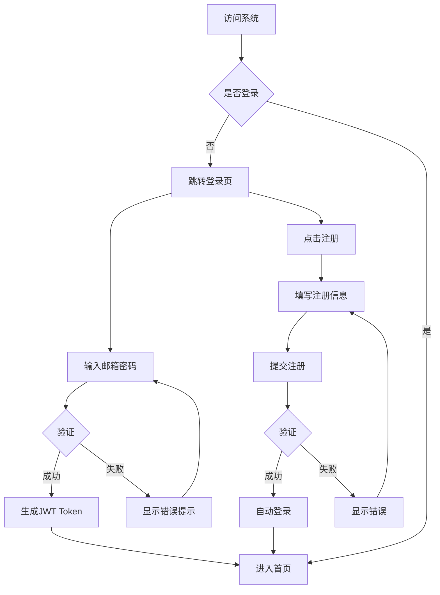
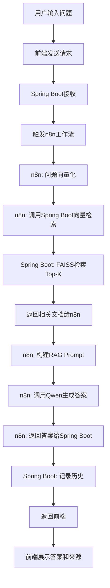
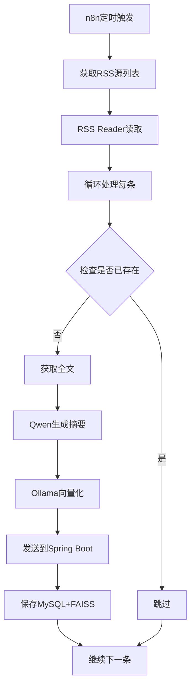
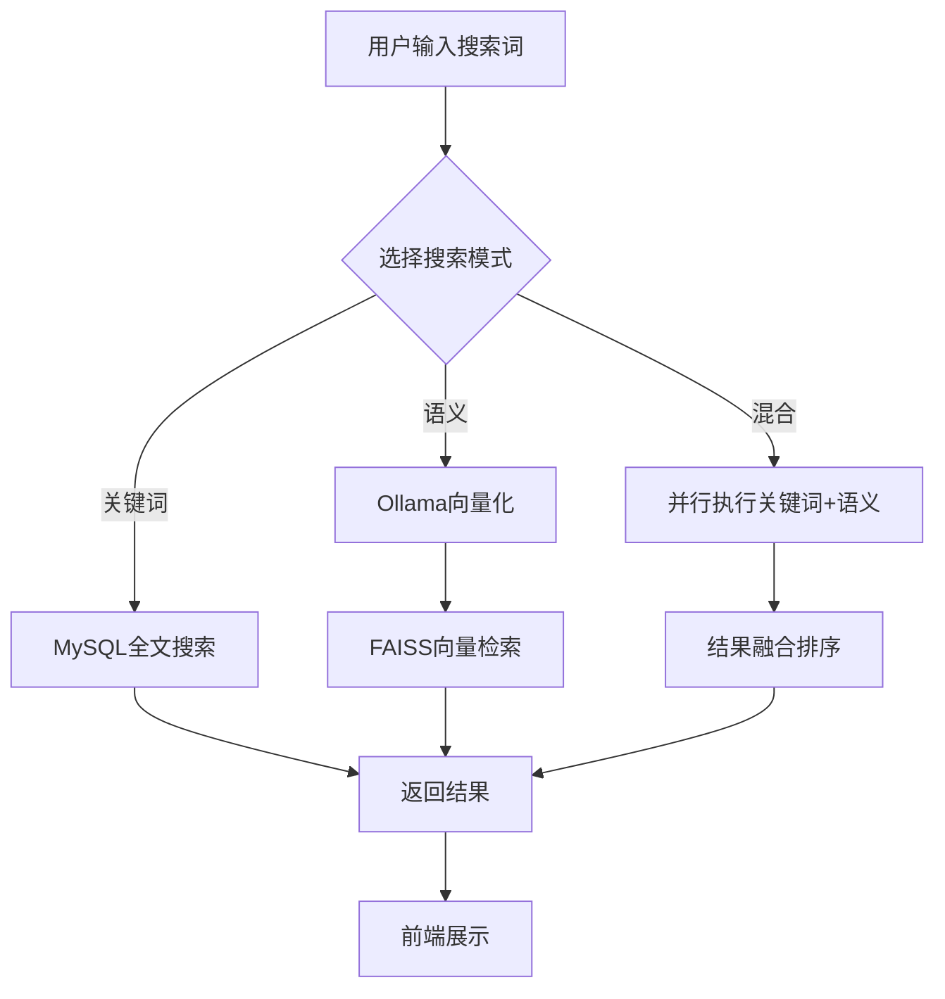

# XU-News-AI-RAG 产品原型设计文档

**版本：** 1.0  
**日期：** 2025年10月15日  
**项目代号：** xu-ai-news-rag  
**设计工具：** Figma / Axure RP（推荐）

---

## 📦 可交互HTML原型已完成

本文档提供的是**完整的可交互HTML原型**，位于 `prototype/` 目录下：

| 文件 | 页面 | 状态 |
|------|------|------|
| `prototype/index.html` | 登录页面 | ✅ 已完成 |
| `prototype/home.html` | 首页 | ✅ 已完成 |
| `prototype/chat.html` | 智能问答页面 | ✅ 已完成 |
| `prototype/search.html` | 搜索页面 | ✅ 已完成 |
| `prototype/knowledge.html` | 知识库管理页面 | ✅ 已完成 |
| `prototype/README.md` | 使用说明 | ✅ 已完成 |

**使用方法：**
- 直接双击 `prototype/index.html` 在浏览器中打开
- 所有页面可交互、可跳转
- 详细使用说明请查看 `prototype/README.md`

---

## 目录

1. [设计说明](#1-设计说明)
2. [整体布局](#2-整体布局)
3. [页面原型](#3-页面原型)
4. [交互流程](#4-交互流程)
5. [组件库](#5-组件库)
6. [响应式设计](#6-响应式设计)

---

## 1. 设计说明

### 1.1 设计原则

| 原则 | 说明 |
|------|------|
| **简洁性** | 界面简洁清晰，避免信息过载 |
| **一致性** | 统一的视觉风格和交互模式 |
| **易用性** | 操作直观，学习成本低 |
| **效率** | 减少操作步骤，提高使用效率 |
| **智能化** | 突出AI功能，提供智能化体验 |

### 1.2 设计规范

#### 颜色规范

```
主色（Primary）：
- #409EFF  蓝色（品牌色）
- #67C23A  绿色（成功）
- #E6A23C  橙色（警告）
- #F56C6C  红色（错误）

辅助色（Secondary）：
- #909399  中性灰
- #303133  主文本
- #606266  次文本
- #C0C4CC  边框

背景色：
- #FFFFFF  白色
- #F5F7FA  浅灰背景
- #EBEEF5  分割线
```

#### 字体规范

```
标题字体：PingFang SC / Microsoft YaHei
- H1: 32px / Bold
- H2: 24px / Bold
- H3: 20px / Medium
- H4: 18px / Medium

正文字体：PingFang SC / Microsoft YaHei
- 正文大: 16px / Regular
- 正文: 14px / Regular
- 正文小: 12px / Regular
```

#### 间距规范

```
内边距（Padding）：
- 超大: 32px
- 大: 24px
- 中: 16px
- 小: 12px
- 超小: 8px

外边距（Margin）：
- 超大: 40px
- 大: 32px
- 中: 24px
- 小: 16px
- 超小: 8px
```

---

## 2. 整体布局

### 2.1 主界面框架

```
┌─────────────────────────────────────────────────────────┐
│                      顶部导航栏                          │
│  [Logo] [首页] [搜索] [问答] [知识库] [数据源]  [用户] │
├──────────┬──────────────────────────────────────────────┤
│          │                                              │
│   侧边   │                                              │
│   导航   │              主内容区                         │
│  （可选） │                                              │
│          │                                              │
│          │                                              │
└──────────┴──────────────────────────────────────────────┘
```

### 2.2 响应式布局

**桌面端（>1200px）：**
- 顶部导航 + 侧边导航 + 主内容区
- 主内容区最大宽度 1200px，居中显示

**平板端（768px - 1200px）：**
- 顶部导航 + 主内容区
- 侧边导航收起为抽屉

**移动端（<768px）：**
- 顶部导航（简化版）+ 主内容区
- 底部导航栏（核心功能）

---

## 3. 页面原型

### 3.1 登录页面（Login.vue）

#### 3.1.1 页面布局

```
┌─────────────────────────────────────────────────────────┐
│                                                         │
│                   [Logo + 标题]                          │
│              XU-News-AI-RAG                             │
│           个性化新闻智能知识库                            │
│                                                         │
│      ┌─────────────────────────────────────┐           │
│      │  ┌─────────────────────────────┐   │           │
│      │  │ 📧 邮箱                      │   │           │
│      │  └─────────────────────────────┘   │           │
│      │                                     │           │
│      │  ┌─────────────────────────────┐   │           │
│      │  │ 🔒 密码                      │   │           │
│      │  └─────────────────────────────┘   │           │
│      │                                     │           │
│      │  [ ] 记住我      [忘记密码?]        │           │
│      │                                     │           │
│      │  ┌─────────────────────────────┐   │           │
│      │  │       登 录                  │   │           │
│      │  └─────────────────────────────┘   │           │
│      │                                     │           │
│      │  还没有账号？ [立即注册]            │           │
│      └─────────────────────────────────────┘           │
│                                                         │
└─────────────────────────────────────────────────────────┘
```

#### 3.1.2 交互说明

| 元素 | 交互行为 |
|------|----------|
| 邮箱输入框 | 聚焦时显示边框高亮，失焦时验证邮箱格式 |
| 密码输入框 | 显示/隐藏密码按钮，支持回车登录 |
| 记住我 | 勾选后保存登录状态7天 |
| 忘记密码 | 跳转到密码重置流程（预留） |
| 登录按钮 | 点击后显示加载状态，登录成功跳转首页 |
| 立即注册 | 跳转到注册页面 |

---

### 3.2 首页（Home.vue）

#### 3.2.1 页面布局

```
┌─────────────────────────────────────────────────────────┐
│ 🏠 首页    🔍 搜索    💬 问答    📚 知识库    ⚙️ 数据源    👤 │
├─────────────────────────────────────────────────────────┤
│                                                         │
│  ┌───────────────────────────────────────────────────┐ │
│  │  🔍  搜索新闻或提问...                    [搜索]   │ │
│  └───────────────────────────────────────────────────┘ │
│                                                         │
│  ┌─ 数据统计 ────────────────────────────────────────┐ │
│  │  📊 总条目: 1,234  |  📅 今日新增: 45  |  🏷️ 标签: 89 │ │
│  └───────────────────────────────────────────────────┘ │
│                                                         │
│  最新新闻                                   [查看全部]  │
│  ┌─────────────────────────────────────────────────┐   │
│  │ 📰 OpenAI发布GPT-5预览版                         │   │
│  │ 来源: TechCrunch | 时间: 2小时前                  │   │
│  │ 📝 OpenAI今日宣布推出GPT-5的早期预览版...       │   │
│  │ 🏷️ AI  GPT  OpenAI                               │   │
│  └─────────────────────────────────────────────────┘   │
│                                                         │
│  ┌─────────────────────────────────────────────────┐   │
│  │ 📰 谷歌推出Gemini Pro 2.0                         │   │
│  │ 来源: The Verge | 时间: 5小时前                   │   │
│  │ 📝 谷歌今天发布了最新的大模型Gemini Pro 2.0...   │   │
│  │ 🏷️ AI  Google  Gemini                            │   │
│  └─────────────────────────────────────────────────┘   │
│                                                         │
│  热门标签                                               │
│  [AI] [机器学习] [深度学习] [NLP] [计算机视觉]        │
│  [Python] [TensorFlow] [PyTorch] [开源] [创业]        │
│                                                         │
└─────────────────────────────────────────────────────────┘
```

#### 3.2.2 功能模块

| 模块 | 说明 |
|------|------|
| **全局搜索框** | 支持关键词搜索和自然语言提问 |
| **数据统计** | 实时显示知识库统计信息 |
| **最新新闻列表** | 展示最近采集的新闻，按时间倒序 |
| **热门标签云** | 展示使用频率最高的标签，可点击筛选 |

---

### 3.3 智能问答页面（Chat.vue）⭐核心页面

#### 3.3.1 页面布局

```
┌─────────────────────────────────────────────────────────┐
│ 🏠    🔍    💬 智能问答    📚    ⚙️                    👤 │
├─────────────────────────────────────────────────────────┤
│                                                         │
│  智能问答助手                          [清空对话] [历史] │
│  ┌──────────────────────────────────────────────────┐  │
│  │  基于您的知识库，为您提供准确的回答                 │  │
│  └──────────────────────────────────────────────────┘  │
│                                                         │
│  ┌── 对话区 ────────────────────────────────────────┐  │
│  │                                                   │  │
│  │  👤 用户                              10:23       │  │
│  │  ┌────────────────────────────────────────────┐  │  │
│  │  │ 最近有哪些关于GPT-5的新闻？                 │  │  │
│  │  └────────────────────────────────────────────┘  │  │
│  │                                                   │  │
│  │  🤖 AI助手                            10:23       │  │
│  │  ┌────────────────────────────────────────────┐  │  │
│  │  │ 根据您的知识库，最近关于GPT-5的新闻有：     │  │  │
│  │  │                                              │  │  │
│  │  │ 1. OpenAI宣布GPT-5进入测试阶段（2小时前）   │  │  │
│  │  │    来源: TechCrunch                          │  │  │
│  │  │    [查看详情]                                │  │  │
│  │  │                                              │  │  │
│  │  │ 2. GPT-5性能提升显著超预期（昨天）          │  │  │
│  │  │    来源: The Verge                           │  │  │
│  │  │    [查看详情]                                │  │  │
│  │  │                                              │  │  │
│  │  │ 这些新闻表明GPT-5在多模态能力...           │  │  │
│  │  └────────────────────────────────────────────┘  │  │
│  │                                                   │  │
│  │  👤 用户                              10:25       │  │
│  │  ┌────────────────────────────────────────────┐  │  │
│  │  │ 详细说说第一条新闻                          │  │  │
│  │  └────────────────────────────────────────────┘  │  │
│  │                                                   │  │
│  │  🤖 正在思考...                                   │  │
│  │                                                   │  │
│  └───────────────────────────────────────────────────┘  │
│                                                         │
│  ┌─────────────────────────────────────────────────┐   │
│  │ 💬 请输入您的问题...                   [📎] [发送] │   │
│  └─────────────────────────────────────────────────┘   │
│                                                         │
│  💡 建议问题：                                          │
│  • 总结一下本周的AI新闻                                 │
│  • 有没有关于开源大模型的消息？                         │
│  • 对比一下GPT-5和Claude 3的特点                       │
│                                                         │
└─────────────────────────────────────────────────────────┘
```

#### 3.3.2 交互设计

| 元素 | 交互行为 |
|------|----------|
| **对话区** | 自动滚动到最新消息，支持滚动查看历史 |
| **用户消息** | 右对齐，蓝色气泡背景 |
| **AI回答** | 左对齐，白色气泡背景，支持Markdown渲染 |
| **引用来源** | 可点击链接，跳转到新闻详情页 |
| **输入框** | 支持多行输入，回车发送，Shift+回车换行 |
| **发送按钮** | 发送中显示加载动画，禁用重复点击 |
| **清空对话** | 二次确认后清空当前会话 |
| **历史记录** | 侧边栏展示历史对话列表 |
| **建议问题** | 点击后自动填充到输入框 |

#### 3.3.3 状态设计

```
正常状态：
┌────────────────────┐
│ 💬 请输入您的问题... │
└────────────────────┘

加载状态：
┌────────────────────┐
│ 🤖 正在思考... ⏳   │
└────────────────────┘

错误状态：
┌────────────────────┐
│ ❌ 回答生成失败      │
│ [重试]              │
└────────────────────┘
```

---

### 3.4 搜索页面（Search.vue）

#### 3.4.1 页面布局

```
┌─────────────────────────────────────────────────────────┐
│ 🏠    🔍 搜索    💬    📚    ⚙️                        👤 │
├─────────────────────────────────────────────────────────┤
│                                                         │
│  ┌─────────────────────────────────────────────────┐   │
│  │  🔍  AI 大模型                            [搜索]  │   │
│  └─────────────────────────────────────────────────┘   │
│                                                         │
│  搜索方式： ⚪ 关键词搜索  🔵 语义搜索  ⚪ 混合搜索    │
│                                                         │
│  ┌─ 筛选条件 ────────────────────────────────────────┐ │
│  │ 来源: [全部 ▼]  日期: [最近一周 ▼]  标签: [全部 ▼] │ │
│  └───────────────────────────────────────────────────┘ │
│                                                         │
│  找到 127 条结果                    排序: [相关度 ▼]    │
│                                                         │
│  ┌─────────────────────────────────────────────────┐   │
│  │ 📰 OpenAI发布GPT-5预览版            相似度: 95% │   │
│  │ 来源: TechCrunch  |  发布: 2小时前  |  查看: 45  │   │
│  │ ─────────────────────────────────────────────── │   │
│  │ OpenAI今日宣布推出GPT-5的早期预览版，据称在     │   │
│  │ 推理能力、多模态理解等方面都有显著提升...       │   │
│  │                                                 │   │
│  │ 🏷️ AI  GPT  OpenAI  大模型                      │   │
│  │ [查看详情] [添加到收藏] [分享]                  │   │
│  └─────────────────────────────────────────────────┘   │
│                                                         │
│  ┌─────────────────────────────────────────────────┐   │
│  │ 📰 谷歌推出Gemini Pro 2.0          相似度: 88%  │   │
│  │ ...                                              │   │
│  └─────────────────────────────────────────────────┘   │
│                                                         │
│  ┌─────────────────────────────────────────────────┐   │
│  │ 📰 Anthropic更新Claude 3.5         相似度: 82%  │   │
│  │ ...                                              │   │
│  └─────────────────────────────────────────────────┘   │
│                                                         │
│  [1] 2 3 4 5 ... 13 [下一页]                           │
│                                                         │
└─────────────────────────────────────────────────────────┘
```

#### 3.4.2 搜索模式说明

| 模式 | 说明 | 适用场景 |
|------|------|----------|
| **关键词搜索** | 基于MySQL全文索引的精确匹配 | 查找特定术语或人名 |
| **语义搜索** | 基于FAISS向量检索的语义理解 | 概念性查询，相关内容发现 |
| **混合搜索** | 结合关键词和语义，结果融合排序 | 综合性查询，获得最佳结果 |

---

### 3.5 知识库管理页面（Knowledge.vue）

#### 3.5.1 页面布局

```
┌─────────────────────────────────────────────────────────┐
│ 🏠    🔍    💬    📚 知识库    ⚙️                      👤 │
├─────────────────────────────────────────────────────────┤
│                                                         │
│  知识库管理                [+新增] [批量导入] [导出]    │
│                                                         │
│  ┌─ 筛选 ──────────────────────────────────────────┐   │
│  │ 🔍 搜索  来源:[全部▼]  标签:[全部▼]  [筛选]     │   │
│  └─────────────────────────────────────────────────┘   │
│                                                         │
│  ┌─────────────────────────────────────────────────┐   │
│  │ [☑] 标题          来源    标签    时间      操作  │   │
│  ├─────────────────────────────────────────────────┤   │
│  │ [ ] OpenAI发布G  TechC.. AI,GPT  2h ago  [编辑]│   │
│  │                                          [删除] │   │
│  ├─────────────────────────────────────────────────┤   │
│  │ [ ] 谷歌推出Gem  TheVe.. AI      5h ago  [编辑]│   │
│  │                                          [删除] │   │
│  ├─────────────────────────────────────────────────┤   │
│  │ [ ] Anthropic更  MIT    AI,LLM   昨天    [编辑]│   │
│  │                                          [删除] │   │
│  └─────────────────────────────────────────────────┘   │
│                                                         │
│  已选 0 项  [批量删除] [批量标签]                      │
│                                                         │
│  显示 1-20 / 共 1,234 条                               │
│  [上一页] 1 2 3 4 5 ... [下一页]                      │
│                                                         │
└─────────────────────────────────────────────────────────┘
```

#### 3.5.2 新增/编辑弹窗

```
┌─────────────────────────────────────────┐
│  新增知识条目                    [×]     │
├─────────────────────────────────────────┤
│                                         │
│  标题 *                                 │
│  ┌───────────────────────────────────┐ │
│  │                                   │ │
│  └───────────────────────────────────┘ │
│                                         │
│  内容 *                                 │
│  ┌───────────────────────────────────┐ │
│  │                                   │ │
│  │                                   │ │
│  │                                   │ │
│  └───────────────────────────────────┘ │
│                                         │
│  来源URL                                │
│  ┌───────────────────────────────────┐ │
│  │                                   │ │
│  └───────────────────────────────────┘ │
│                                         │
│  标签                                   │
│  ┌───────────────────────────────────┐ │
│  │ AI, GPT, OpenAI                   │ │
│  └───────────────────────────────────┘ │
│  输入标签后按回车添加                    │
│                                         │
│  发布时间                               │
│  ┌───────────────────────────────────┐ │
│  │ 2025-10-15 10:00                  │ │
│  └───────────────────────────────────┘ │
│                                         │
│            [取消]      [保存]           │
└─────────────────────────────────────────┘
```

---

### 3.6 数据源管理页面（Sources.vue）

#### 3.6.1 页面布局

```
┌─────────────────────────────────────────────────────────┐
│ 🏠    🔍    💬    📚    ⚙️ 数据源                      👤 │
├─────────────────────────────────────────────────────────┤
│                                                         │
│  数据源管理                     [+ 添加RSS源]           │
│                                                         │
│  ┌─ RSS订阅源 ──────────────────────────────────────┐  │
│  │                                                   │  │
│  │  ┌────────────────────────────────────────────┐  │  │
│  │  │ 🟢 36氪                              [编辑] │  │  │
│  │  │ https://36kr.com/feed                      │  │  │
│  │  │ 最后采集: 1小时前  |  今日新增: 12条        │  │  │
│  │  │ [测试采集] [暂停] [删除]                    │  │  │
│  │  └────────────────────────────────────────────┘  │  │
│  │                                                   │  │
│  │  ┌────────────────────────────────────────────┐  │  │
│  │  │ 🟢 少数派                            [编辑] │  │  │
│  │  │ https://sspai.com/feed                     │  │  │
│  │  │ 最后采集: 30分钟前  |  今日新增: 8条         │  │  │
│  │  │ [测试采集] [暂停] [删除]                    │  │  │
│  │  └────────────────────────────────────────────┘  │  │
│  │                                                   │  │
│  │  ┌────────────────────────────────────────────┐  │  │
│  │  │ 🔴 TechCrunch (已暂停)               [编辑] │  │  │
│  │  │ https://techcrunch.com/feed                │  │  │
│  │  │ 最后采集: 2天前  |  今日新增: 0条            │  │  │
│  │  │ [测试采集] [启用] [删除]                    │  │  │
│  │  └────────────────────────────────────────────┘  │  │
│  │                                                   │  │
│  └───────────────────────────────────────────────────┘  │
│                                                         │
│  ┌─ 采集统计 ────────────────────────────────────────┐  │
│  │  📊 本周采集: 342条  |  成功率: 95%  |  平均: 49/天│  │
│  └───────────────────────────────────────────────────┘  │
│                                                         │
│  ┌─ 采集日志 ────────────────────────────────────────┐  │
│  │  ✅ 36氪 - 采集成功 12条  (1小时前)                │  │
│  │  ✅ 少数派 - 采集成功 8条  (30分钟前)              │  │
│  │  ❌ TechCrunch - 采集失败: 连接超时 (2小时前)     │  │
│  │  ✅ 阮一峰的网络日志 - 采集成功 1条  (3小时前)     │  │
│  └───────────────────────────────────────────────────┘  │
│                                                         │
└─────────────────────────────────────────────────────────┘
```

#### 3.6.2 添加RSS源弹窗

```
┌─────────────────────────────────────────┐
│  添加RSS订阅源                   [×]     │
├─────────────────────────────────────────┤
│                                         │
│  名称 *                                 │
│  ┌───────────────────────────────────┐ │
│  │ 36氪                              │ │
│  └───────────────────────────────────┘ │
│                                         │
│  RSS地址 *                              │
│  ┌───────────────────────────────────┐ │
│  │ https://36kr.com/feed             │ │
│  └───────────────────────────────────┘ │
│                                         │
│  采集频率                               │
│  ┌───────────────────────────────────┐ │
│  │ 每小时 ▼                          │ │
│  └───────────────────────────────────┘ │
│                                         │
│  自动采集                               │
│  [✓] 添加后立即启用                     │
│                                         │
│            [取消]      [测试并添加]      │
└─────────────────────────────────────────┘
```

---

### 3.7 数据统计页面（Dashboard.vue）

#### 3.7.1 页面布局

```
┌─────────────────────────────────────────────────────────┐
│ 🏠    🔍    💬    📚    ⚙️    📊 统计                  👤 │
├─────────────────────────────────────────────────────────┤
│                                                         │
│  数据统计                          日期: [本周 ▼]      │
│                                                         │
│  ┌─ 核心指标 ────────────────────────────────────────┐  │
│  │  ┌─────────┐  ┌─────────┐  ┌─────────┐  ┌──────┐ │  │
│  │  │ 📚 1,234│  │ 📈 +45  │  │ 🏷️  89  │  │ 🔍 234││  │
│  │  │ 总条目  │  │ 今日新增│  │ 标签数  │  │ 检索次││  │
│  │  └─────────┘  └─────────┘  └─────────┘  └──────┘ │  │
│  └───────────────────────────────────────────────────┘  │
│                                                         │
│  ┌─ 采集趋势 ────────────────────────────────────────┐  │
│  │              📊 每日采集量趋势                     │  │
│  │   60 ┤                              ●              │  │
│  │   50 ┤            ●        ●     ●                 │  │
│  │   40 ┤      ●           ●                          │  │
│  │   30 ┤   ●                                         │  │
│  │   20 ┤                                             │  │
│  │   10 ┤                                             │  │
│  │    0 └──┬───┬───┬───┬───┬───┬───                 │  │
│  │        周一 周二 周三 周四 周五 周六 周日           │  │
│  └───────────────────────────────────────────────────┘  │
│                                                         │
│  ┌─ 来源分布 ────────┐  ┌─ 标签云 ──────────────────┐  │
│  │   📊 饼图          │  │   AI        机器学习       │  │
│  │                   │  │      深度学习    NLP      │  │
│  │   36氪: 35%       │  │   Python   TensorFlow     │  │
│  │   少数派: 25%     │  │      GPT      开源        │  │
│  │   其他: 40%       │  │   计算机视觉   创业        │  │
│  └───────────────────┘  └───────────────────────────┘  │
│                                                         │
│  ┌─ 热门检索 ────────────────────────────────────────┐  │
│  │  1. GPT-5 发布                      检索 45 次     │  │
│  │  2. 大模型训练                      检索 32 次     │  │
│  │  3. AI 应用                         检索 28 次     │  │
│  │  4. 开源模型对比                    检索 24 次     │  │
│  │  5. LangChain 教程                  检索 21 次     │  │
│  └───────────────────────────────────────────────────┘  │
│                                                         │
└─────────────────────────────────────────────────────────┘
```

---

## 4. 交互流程

### 4.1 用户注册登录流程



### 4.2 智能问答流程



### 4.3 新闻采集流程



### 4.4 搜索流程



---

## 5. 组件库

### 5.1 通用组件

#### 5.1.1 搜索框组件（SearchBar.vue）

```vue
<SearchBar
  v-model="query"
  placeholder="搜索新闻或提问..."
  :search-types="['keyword', 'semantic', 'hybrid']"
  @search="handleSearch"
/>
```

#### 5.1.2 新闻卡片组件（NewsCard.vue）

```vue
<NewsCard
  :title="news.title"
  :summary="news.summary"
  :source="news.sourceName"
  :time="news.publishTime"
  :tags="news.tags"
  :url="news.sourceUrl"
  @click="viewDetail"
/>
```

#### 5.1.3 标签组件（TagList.vue）

```vue
<TagList
  :tags="['AI', 'GPT', 'OpenAI']"
  :editable="true"
  @add="handleAddTag"
  @remove="handleRemoveTag"
/>
```

#### 5.1.4 聊天气泡组件（ChatBubble.vue）

```vue
<ChatBubble
  :role="'user'"
  :content="message.content"
  :timestamp="message.timestamp"
/>
```

---

## 6. 响应式设计

### 6.1 断点设计

```
超小屏（手机）: < 768px
小屏（平板）  : 768px - 992px
中屏（桌面）  : 992px - 1200px
大屏（大桌面）: > 1200px
```

### 6.2 移动端适配

#### 6.2.1 移动端导航

```
┌────────────────────────┐
│ ☰  XU-News-AI-RAG   👤 │
├────────────────────────┤
│                        │
│      主内容区          │
│                        │
│                        │
├────────────────────────┤
│ 🏠  🔍  💬  📚  ⚙️     │
└────────────────────────┘
```

#### 6.2.2 移动端问答页面

```
┌────────────────────────┐
│ ← 智能问答         ⋮   │
├────────────────────────┤
│                        │
│ 对话区（上下滚动）      │
│                        │
│                        │
│                        │
│                        │
│                        │
├────────────────────────┤
│ 💬 输入...        [发送]│
└────────────────────────┘
```

---

## 7. 原型设计工具推荐

### 7.1 Figma（推荐）

**优点：**
- ✅ 在线协作，无需安装
- ✅ 丰富的UI组件库
- ✅ 支持原型交互
- ✅ 免费版功能充足

**使用步骤：**
1. 访问 [Figma.com](https://www.figma.com)
2. 创建新项目 "XU-News-AI-RAG"
3. 导入Element Plus设计系统
4. 根据本文档创建各页面原型
5. 设置页面间跳转链接
6. 导出原型预览链接

### 7.2 Axure RP

**优点：**
- ✅ 专业原型设计工具
- ✅ 强大的交互设计能力
- ✅ 支持动态面板和变量

**使用步骤：**
1. 安装Axure RP 10
2. 创建新项目
3. 使用元件库搭建页面
4. 设置交互事件
5. 生成HTML原型文件

---

## 8. 原型交付物清单

### 8.1 必须交付

- [x] 登录页面原型
- [x] 注册页面原型
- [x] 首页原型
- [x] **智能问答页面原型（核心）**
- [x] 搜索页面原型
- [x] 知识库管理页面原型
- [x] 数据源管理页面原型

### 8.2 可选交付

- [ ] 数据统计页面原型
- [ ] 用户设置页面原型
- [ ] 帮助文档页面原型

### 8.3 交付格式

1. **Figma链接**（推荐）
   - 分享原型预览链接
   - 可交互演示

2. **Axure HTML**
   - 导出完整HTML文件夹
   - 可离线查看

3. **PDF文档**（备选）
   - 导出各页面截图
   - 附带交互说明

---

## 9. 设计验证清单

### 9.1 易用性检查

- [ ] 所有按钮都有清晰的文字说明
- [ ] 输入框都有placeholder提示
- [ ] 错误信息清晰易懂
- [ ] 操作步骤不超过3步
- [ ] 关键操作有二次确认

### 9.2 一致性检查

- [ ] 颜色使用符合规范
- [ ] 字体大小统一
- [ ] 间距符合8px栅格
- [ ] 图标风格一致
- [ ] 交互模式统一

### 9.3 功能完整性

- [ ] 所有功能都有对应页面
- [ ] 关键流程闭环完整
- [ ] 异常情况有处理
- [ ] 加载状态有提示
- [ ] 空状态有引导

---

## 10. 附录

### 10.1 图标资源

推荐使用：
- [Element Plus Icons](https://element-plus.org/zh-CN/component/icon.html)
- [Font Awesome](https://fontawesome.com/)
- [Iconify](https://iconify.design/)

### 10.2 UI组件库

- [Element Plus](https://element-plus.org/zh-CN/) - Vue 3 UI框架
- [Ant Design Vue](https://antdv.com/components/overview-cn) - 备选方案

### 10.3 设计参考

- ChatGPT - 智能问答界面参考
- Notion - 知识库管理参考
- Feedly - RSS阅读器参考

---

**文档版本：** 1.0  
**最后更新：** 2025年10月15日  
**设计师：** XU产品团队

**审批流程：**
- [ ] 产品经理审批
- [ ] UI设计师审批
- [ ] 技术负责人审批

---

## 附件说明

本文档提供了详细的页面布局和交互设计说明。实际原型文件建议使用Figma制作，可实现：
- ✅ 可交互的原型演示
- ✅ 页面间的跳转链接
- ✅ 模拟真实的用户体验

**Figma项目命名：** `XU-News-AI-RAG-Prototype-v1.0`

**原型预览链接（待创建）：** `https://www.figma.com/proto/...`

